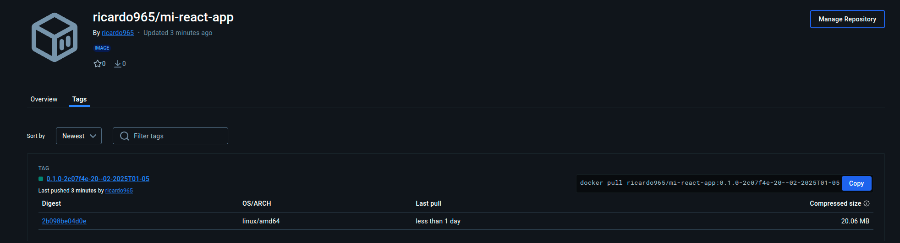

# 📦 Documentación: CI/CD con GitHub Actions y Docker Hub

## ✅ **1. Creación del Dockerfile**

Creo un `Dockerfile` para construir la aplicación React usando NGINX como servidor y tambien genero una configuracion para nginx llamado nginx.conf:

```
FROM node:18-alpine AS build
WORKDIR /app
COPY package*.json ./
RUN npm install
COPY . .
RUN npm run build
FROM nginx:alpine
COPY nginx.conf /etc/nginx/conf.d/default.conf
RUN rm -rf /usr/share/nginx/html/*
COPY --from=build /app/build /usr/share/nginx/html
EXPOSE 80
ENTRYPOINT ["nginx", "-g", "daemon off;"]
```

---

## 🔄 **2. Configuración del Workflow en GitHub Actions**

Creo un workflow (`.github/workflows/build.yml`) que:

1. **Hace checkout del repositorio.**
2. **Configura Docker Buildx.**
3. **Obtiene la versión del `package.json`, el hash del commit y un timestamp.**
4. **Construye la imagen Docker.**
5. **Etiqueta la imagen con el formato:**

```
<versión-del-package.json>-<hash-del-commit>-<timestamp>

```

1. **Hace push a Docker Hub.**

---

## 🔐 **3. Configuración de Secretos en GitHub**

Para acceder a Docker Hub desde GitHub Actions, creamos **secrets**:

1. En mi repositorio → `Settings` → `Secrets and variables` → `Actions`.
2. Haz clic en **`New repository secret`**.
3. Crea los siguientes secretos:

- `DOCKERHUB_USERNAME`: Mi usuario de Docker Hub.
- `DOCKERHUB_TOKEN`: Un token generado en Docker Hub.

### 🎟️ **Cómo obtener el token en Docker Hub:**

1. Inicio sesión en [Docker Hub](https://hub.docker.com/).
2. Ve a **Account Settings** → **Security**.
3. Crea un nuevo **Access Token**.
4. Copia el token y guárdalo en `DOCKERHUB_TOKEN`.

---

## 🚀 **4. Ejecución del Workflow**

Cada vez que hago un **push en la rama `main`**, GitHub Actions:

1. Construye la imagen Docker.
2. La etiqueta siguiendo el formato especificado.
3. La sube a Docker Hub.

# Resultado


